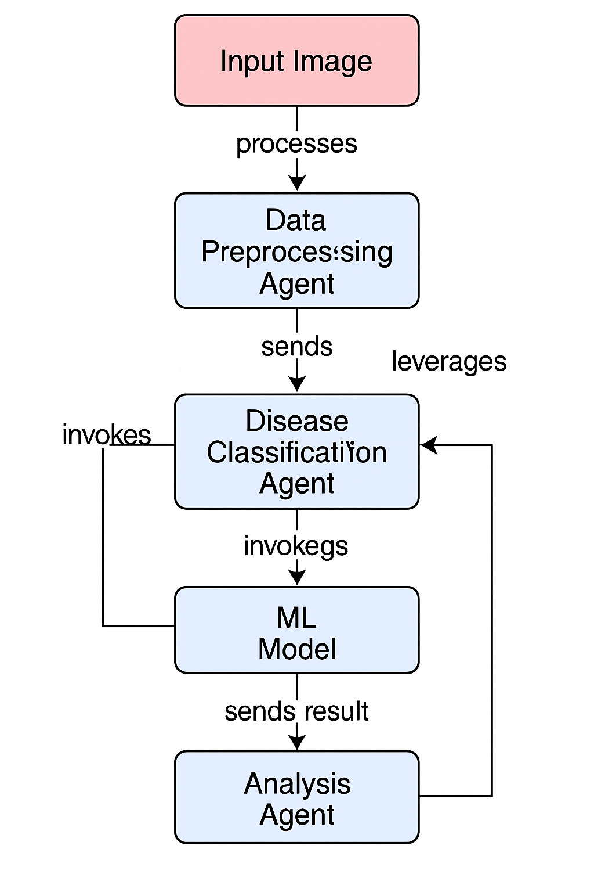

# cropdisease_multi_agentic
Multi-Agent System for Crop Disease Detection and Analysis

# Crop Disease Detection using Multi-Agent Architecture

## 🌱 Overview
This project implements a **multi-agent system** for detecting and analyzing crop diseases. By leveraging **agent-based architecture**, the system enables distributed decision-making, dynamic task allocation, and efficient data processing for precision agriculture.

## 🔍 Key Features
- **Multi-Agent Collaboration**: Agents work together to process agricultural data and detect crop diseases.
- **Machine Learning Integration**: Supports ML models for image-based disease classification.
- **Scalable Architecture**: Easily extendable to include new agents for additional tasks.
- **Dynamic Communication**: Agents exchange information to improve detection accuracy.

## 🛠️ Tech Stack
- **Language**: Python (or specify if Java/other)
- **Frameworks**: [e.g., FastAPI, Flask, JADE]
- **ML Libraries**: TensorFlow / PyTorch
- **Data**: Crop disease datasets (PlantVillage or custom)

## Description of Flowchart


!Flowchart.png
- Input Image → processed by Data Preprocessing Agent
- Data Preprocessing Agent → sends data to Disease Classification Agent
- Disease Classification Agent → invokes ML Model for prediction
- Analysis Agent → provides insights or recommendations

📌 Future Enhancements

- Add reinforcement learning for adaptive agent behavior.
- Integrate IoT sensors for real-time crop monitoring.
- Deploy as a cloud-based service.

📄 License
This project is licensed under the MIT License. See LICENSE for details.
🤝 Contributing
Contributions are welcome! Please fork the repository and submit a pull request.

## 🚀 Installation
1. Clone the repository:
   ```bash
   git clone https://github.com/padeirocarlos/cropdisease_multi_agentic.git
   curl -fsSL https://ollama.com/install.sh | sh
   ollama server
   ollama pull ollama3  # pull one of this model:  gemma4B_v gemma12B_v qwen3 gemini ollama3.2 deepseek
   cd cropdisease_multi_agentic
   uv add -r requirements.txt
   uv run main.py